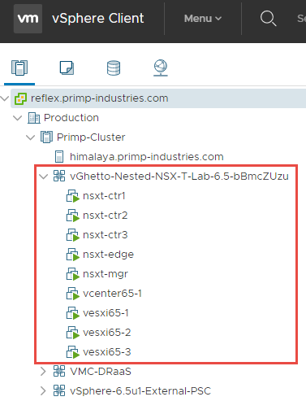
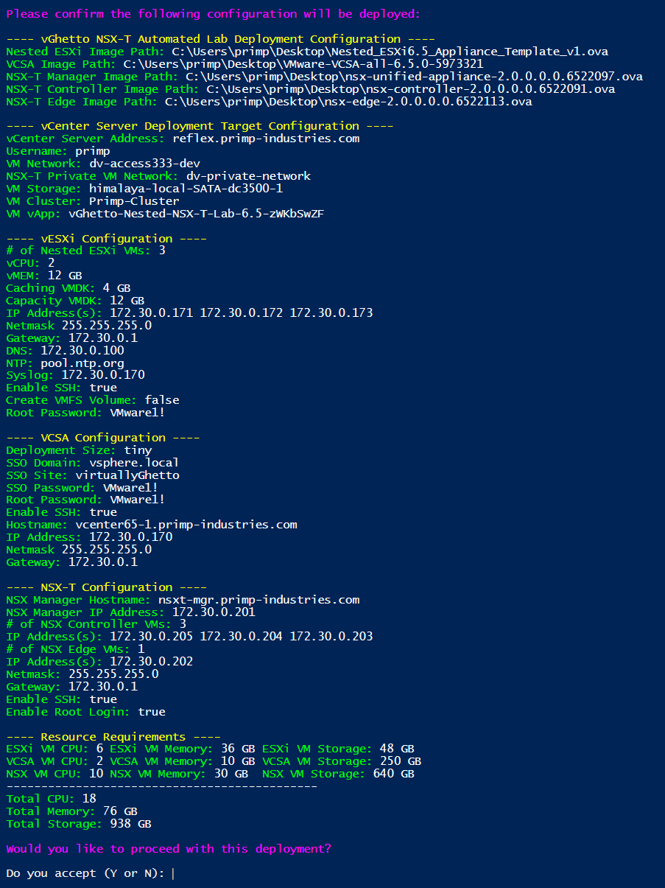
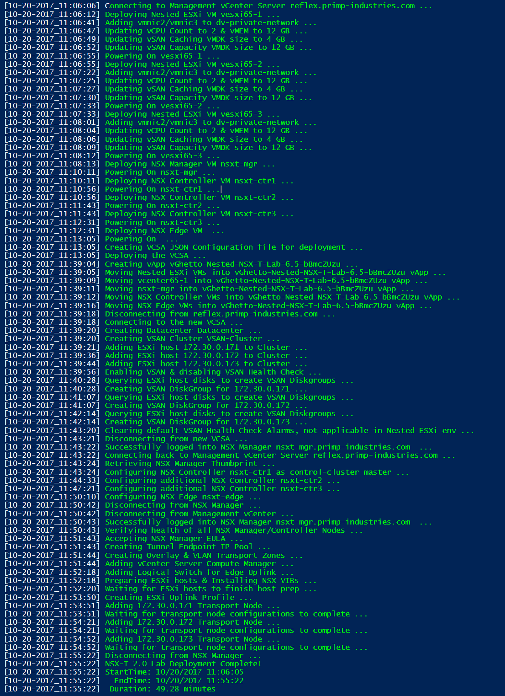
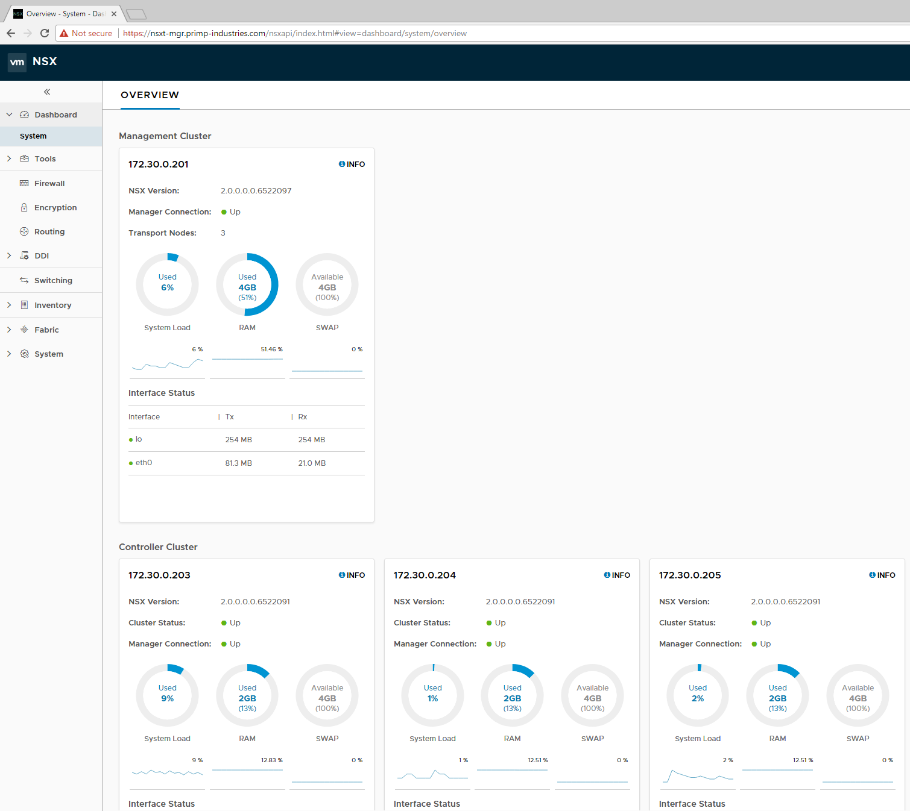
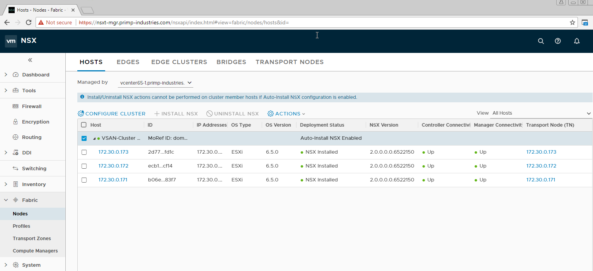

# NSX-T Automated Lab Deployment


## Table of Contents

* [Description](#description)
* [Changelog](#changelog)
* [Requirements](#requirements)
* [Configuration](#configuration)
* [Logging](#logging)
* [Verification](#verification)
* [Sample Execution](#sample-execution)

## Description

Automated deployment of a fully functional NSX-T 2.x and vSphere 6.5 Update 1 environment which includes a set of Nested ESXi Virtual Appliance(s) configured w/vSAN as well as a vCenter Server Appliance (VCSA) using PowerCLI. For information, you can refer to this blog post [here](http://www.virtuallyghetto.com/2017/10/vghetto-automated-nsx-t-2-0-lab-deployment.html) for more details.

Below is an screenshot of an example deployment:



## Changelog

## Requirements
* vCenter Server endpoint running at least vSphere 6.0u2 or later
* Windows system that supports PowerCLI
* [PowerCLI 6.5.3](https://code.vmware.com/web/dp/tool/vmware-powercli/6.5.3)
* Download [nsxt-2.0-lab-deployment.ps1](nsxt-2.0-lab-deployment.ps1) script
* vCenter Server Appliance (VCSA) 6.5 Update 1/1a/1d extracted ISO
* Nested ESXi [6.5 Update 1](https://download3.vmware.com/software/vmw-tools/nested-esxi/Nested_ESXi6.5u1_Appliance_Template_v1.0.ova) Virtual Appliance OVA
* Enable either [MAC Learning](https://williamlam.com/2018/04/native-mac-learning-in-vsphere-6-7-removes-the-need-for-promiscuous-mode-for-nested-esxi.html) or [Promiscuous Mode](https://kb.vmware.com/kb/1004099) on your physical ESXi host networking to ensure proper network connectivity for Nested ESXi workloads
* NSX-T 2.0 or 2.1
    * 2.0
        * [NSX-T 2.0 Manager for ESXi OVA](https://my.vmware.com/group/vmware/details?downloadGroup=NSX-T-200&productId=673&download=true&fileId=161b0d1e65499b4216d03a2dca77fa02&secureParam=1a9c971d283a8c95b6e6ed23e3a201aa&uuId=c64e8223-2b08-46f5-9560-807bf190081b&downloadType=)
        * [NSX-T 2.0 Controller for ESXi OVA](https://my.vmware.com/group/vmware/details?downloadGroup=NSX-T-200&productId=673&download=true&fileId=aef9a46121a71d212a0063519ec6dd7f&secureParam=e067e020dc6d6114e88dbfdf80c62385&uuId=1c895c23-6ba2-481c-95ee-b4b21d3229c0&downloadType=)
        * [NSX-T 2.0 Edge For ESXi OVA](https://my.vmware.com/group/vmware/details?downloadGroup=NSX-T-200&productId=673&download=true&fileId=17edec8462f72c324413963955d8c599&secureParam=65c571d6cf1b803b4bb6187cfb6f91d4&uuId=4eabd6f0-0a11-43b1-b48c-e4c2f42046a9&downloadType=)
    * 2.1
        * [NSX-T 2.1 Manager for ESXi OVA](https://my.vmware.com/group/vmware/details?downloadGroup=NSX-T-210&productId=673&download=true&fileId=ceb09d4c2a044e745be0e5ab7f698295&secureParam=4faa362cd30eda7241a9471ee692774b&uuId=e268e430-59fd-45f2-a7c4-08629fe084ef&downloadType=)
        * [NSX-T 2.1 Controller for ESXi OVA](https://my.vmware.com/group/vmware/details?downloadGroup=NSX-T-210&productId=673&download=true&fileId=46f4cf5fa854bcd4f2c74f849e7acb69&secureParam=852f862526f99ea5f73fda3fb455ca14&uuId=e7c7f09a-3567-4aa4-9c80-d30bdae030fe&downloadType=)
        * [NSX-T 2.1 Edge For ESXi OVA](https://my.vmware.com/group/vmware/details?downloadGroup=NSX-T-210&productId=673&download=true&fileId=46bdb3be8b48cdea045eed660a9d68d0&secureParam=35cf3c9f5f143fd48a74afd1773cde7f&uuId=dd993136-275e-43b6-83e7-6ba10fec89ac&downloadType=)

## Configuration

This section describes the credentials to your vCenter Server in which the NSX-T lab environment will be deployed to:
```console
$VIServer = "vcenter.primp-industries.com"
$VIUsername = "primp"
$VIPassword = "MY-SUPER-DUPER-SECURE-PASSWORD-IS-VMWARE-123"
```

This section describes the location of the files required for deployment. All five variables are mandatory.

```console
$NestedESXiApplianceOVA = "C:\Users\primp\Desktop\Nested_ESXi6.5_Appliance_Template_v1.ova"
$VCSAInstallerPath = "C:\Users\primp\Desktop\VMware-VCSA-all-6.5.0-5973321"
$NSXTManagerOVA = "C:\Users\primp\Desktop\nsx-unified-appliance-2.0.0.0.0.6522097.ova"
$NSXTControllerOVA = "C:\Users\primp\Desktop\nsx-controller-2.0.0.0.0.6522091.ova"
$NSXTEdgeOVA = "C:\Users\primp\Desktop\nsx-edge-2.0.0.0.0.6522113.ova"
```

This section defines the number of Nested ESXi VMs to deploy along with their associated IP Address(s). The names are merely the display name of the VMs when deployed. At a minimum, you should deploy at least three hosts, but you can always add additional hosts and the script will automatically take care of provisioning them correctly.
```console
$NestedESXiHostnameToIPs = @{
"vesxi65-1" = "172.30.0.171"
"vesxi65-2" = "172.30.0.172"
"vesxi65-3" = "172.30.0.173"
}
```

This section describes the resources allocated to each of the Nested ESXi VM(s). Depending on the deployment type, you may need to increase the resources. For Memory and Disk configuration, the unit is in GB.
```console
$NestedESXivCPU = "2"
$NestedESXivMEM = "12"
$NestedESXiCachingvDisk = "4"
$NestedESXiCapacityvDisk = "12"
```

This section describes the VCSA deployment configuration such as the VCSA deployment size, Networking & SSO configurations. If you have ever used the VCSA CLI Installer, these options should look familiar.
```console
$VCSADeploymentSize = "tiny"
$VCSADisplayName = "vcenter65-1"
$VCSAIPAddress = "172.30.0.170"
$VCSAHostname = "vcenter65-1.primp-industries.com" #Change to IP if you don't have valid DNS
$VCSAPrefix = "24"
$VCSASSODomainName = "vsphere.local"
$VCSASSOSiteName = "virtuallyGhetto"
$VCSASSOPassword = "VMware1!"
$VCSARootPassword = "VMware1!"
$VCSASSHEnable = "true"
```

This section describes the location as well as the generic networking settings applied to BOTH the Nested ESXi VM and VCSA.
```console
$VMCluster = "Primp-Cluster"
$VirtualSwitchType = "VDS" # VSS or VDS
$VMNetwork = "dv-access333-dev"
$VMDatastore = "himalaya-local-SATA-dc3500-1"
$VMNetmask = "255.255.255.0"
$VMGateway = "172.30.0.1"
$VMDNS = "172.30.0.100"
$VMNTP = "pool.ntp.org"
$VMPassword = "VMware1!"
$VMDomain = "primp-industries.com"
$VMSyslog = "172.30.0.170"
# Applicable to Nested ESXi only
$VMSSH = "true"
$VMVMFS = "false"
```

This section describes the configuration of the new vCenter Server from the deployed VCSA.
```console
$NewVCDatacenterName = "Datacenter"
$NewVCVSANClusterName = "VSAN-Cluster"
```

This section describes the general NSX-T configurations and most of the defaults can be left alone outside of the envriomental specific configurations such as **NSXPrivatePortgroup** property.
```console
$DeployNSX = 1
$NSXRootPassword = "VMware1!"
$NSXAdminUsername = "admin"
$NSXAdminPassword = "VMware1!"
$NSXAuditUsername = "audit"
$NSXAuditPassword = "VMware1!"
$NSXSSHEnable = "true"
$NSXEnableRootLogin = "true" # this is required to be true for now until we have NSX-T APIs for initial setup
$NSXPrivatePortgroup = "dv-private-network" # ensure this exists in your network

$TunnelEndpointName = "TEP-IP-Pool"
$TunnelEndpointDescription = "Tunnel Endpoint for Transport Nodes"
$TunnelEndpointIPRangeStart = "192.168.1.10"
$TunnelEndpointIPRangeEnd = "192.168.1.20"
$TunnelEndpointCIDR = "192.168.1.0/24"
$TunnelEndpointGateway = "192.168.1.1"

$OverlayTransportZoneName = "Overlay-TZ"
$VlanTransportZoneName = "VLAN-TZ"

$LogicalSwitchName = "Edge-Uplink"
$LogicalSwitchVlan = "0"

$ESXiUplinkProfileName = "ESXi-Uplink-Profile"
$ESXiUplinkProfilePolicy = "FAILOVER_ORDER" # Leave alone unless you know what you're doing
$ESXiUplinkProfileActivepNIC = "vmnic2" # vminic2 or vminic 3, Leave alone unless you know what you're doing
$ESXiUplinkProfileTransportVLAN = "0"
$ESXiUplinkProfileMTU = "1600"

$EdgeUplinkProfileName = "Edge-Uplink-Profile"
$EdgeUplinkProfilePolicy = "FAILOVER_ORDER"
$EdgeUplinkProfileActivepNIC = "fp-eth1"
$EdgeUplinkProfileTransportVLAN = "0"
$EdgeUplinkProfileMTU = "1600"

$EdgeClusterName = "Edge-Cluster-01"
```

This section describes the NSX-T Manager configuration. Currently, the re-sizing of the VM has not been enabled but will be possible in the future. For now, you can simply adjust the Hostname/IP Address.
```console
$NSXTMgrDeploymentSize = "small"
$NSXTMgrvCPU = "2"
$NSXTMgrvMEM = "8"
$NSXTMgrDisplayName = "nsxt-mgr"
$NSXTMgrHostname = "nsxt-mgr.primp-industries.com"
$NSXTMgrIPAddress = "172.30.0.201"
```

This section describes the NSX-T Controller configuration. You can deploy N-number of Controllers by simply adding entries to the hash table. Currently, the re-sizing of the VM has not been enabled but will be possible in the future.
```console
$NSXTCtrvCPU = "2"
$NSXTCtrvMEM = "6"
$NSXControllerSharedSecret = "s3cR3ctz"
$NSXTControllerHostnameToIPs = @{
"nsxt-ctr1" = "172.30.0.203"
"nsxt-ctr2" = "172.30.0.204"
"nsxt-ctr3" = "172.30.0.205"
}
```

This section describes the NSX-T Edge configuration. You can deploy N-number of Edges by simply adding entries to the hash table. Currently, the re-sizing of the VM has not been enabled but will be possible in the future.
```console
$NSXTEdgevCPU = "2"
$NSXTEdgevMEM = "4"
$NSXTEdgeHostnameToIPs = @{
"nsxt-edge" = "172.30.0.202"
}
```

Once you have saved your changes, you can now run the PowerCLI script as you normally would.

## Logging

There is additional verbose logging that outputs as a log file in your current working directory called **nsxt20-lab-deployment.log** which can be useful for debugging purposes.

## Verification

Once you have saved all your changes, you can then run the script. You will be provided with a summary of what will be deployed and you can verify that everything is correct before attempting the deployment. Below is a screenshot on what this would look like:



**Note:** Although the resource requirements may seem quite high, I found in my lab setup, the memory footprint was signifcantly smaller, espeically for storage which ended up only consuming 67GB. For home labs, you can definitely reduce the memory of the NSX setup, but this was nothing something I had looked into great detail. The script will also have an option in the future to automatically shrink vCPU and vMEM based on user configuration but for the initial release, I stuck with the pre-defined defualts for what NSX-T calls a "small" deployment. 

## Sample Execution

Here is an example deployment:




If everything is succesful, you can now login to both your vCenter Server as well as NSX Manager. The NSX-T Manager has a new HTML5 UI which is decoupled from vCenter Server. To access it, open a browser to the following URL: **https://[NSXT-MANAGER-ADDRESS]** and using the admin credentials you had configured earlier.

Once logged in, you will see an overview of all your NSX Nodes by selecting the *Dashboard** tab on the left side.



You can also verify that all your ESXi hosts have been properly configurd and prepared by selecting the **Fabric** tab on the left side and navigating to *HOSTS* tab at the top.

